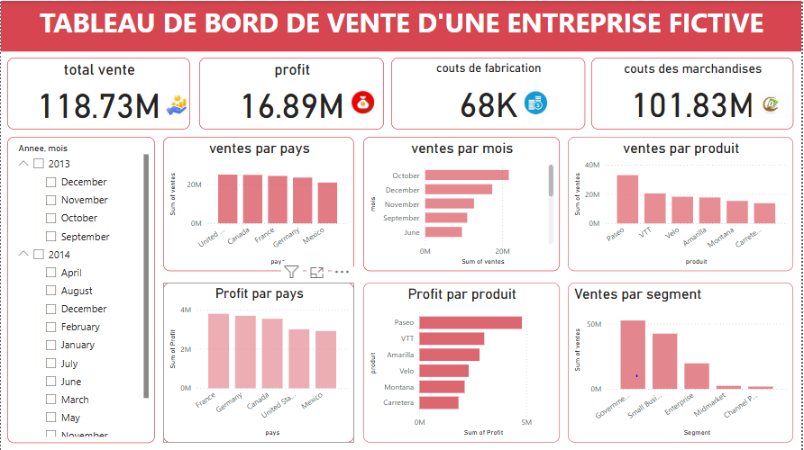

# 📊 Tableau de Bord de Vente d'une Entreprise Fictive

Ce projet présente un **tableau de bord de vente interactif**, développé dans le but de démontrer mes compétences en **Data Analysis**, **visualisation de données**, et en **utilisation d'outils de BI** comme Power BI.

---

## 🔍 Objectif du projet

Le but est de fournir une **vue synthétique et dynamique** des performances commerciales d'une entreprise fictive à travers différents indicateurs clés, en permettant une analyse par période, pays, produits et segments de marché.

---

## 🧩 Contenu du dashboard

### ✅ Indicateurs principaux

- **Total des ventes** : `118.73M`
- **Profit total** : `16.89M`
- **Coûts de fabrication** : `68K`
- **Coût des marchandises vendues (COGS)** : `101.83M`

### 📅 Filtres

- Sélection par **année** et **mois** (via slicer interactif)

### 📊 Visualisations

- **Ventes par pays** : Représente la répartition géographique du chiffre d'affaires.
- **Ventes par mois** : Montre la tendance mensuelle des ventes.
- **Ventes par produit** : Compare les produits selon leurs ventes.
- **Profit par pays** : Permet d’identifier les pays les plus rentables.
- **Profit par produit** : Analyse la marge par catégorie de produit.
- **Ventes par segment de client** : Donne une vue sur les performances selon les segments comme Gouvernement, Petites entreprises, etc.

---

## 🛠️ Outils utilisés

- [Power BI Desktop](https://powerbi.microsoft.com/)
- DAX (pour les mesures dynamiques)
- Visuals natifs Power BI (bar charts, cartes, slicers, etc.)

---

## 📷 Aperçu

---
## 💼 Auteur

👤 *OUSSEIN IBRAHIM*  
📧 *oussein001@gmail.com*  
🌐 [Mon LinkedIn](www.linkedin.com/in/oussein-ibrahim-0a0883339)

